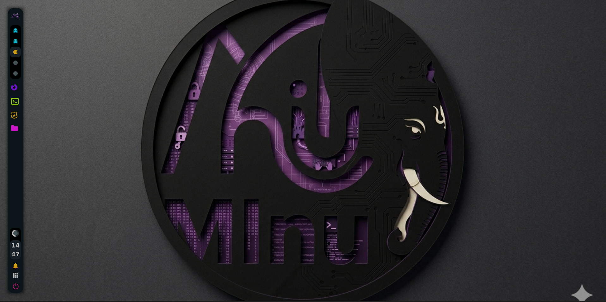
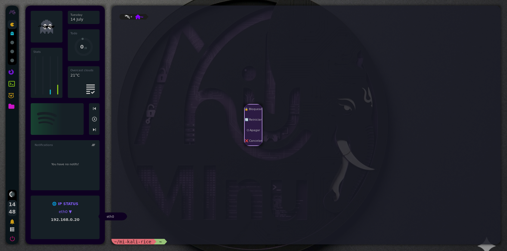

# 💜 Kali Linux AwesomeWM Rice
# DebianAwesomeWM
<div align="center">
     <h1>Awesome Dotfiles</h1>
 </div>

<div align=center>

<a href="https://awesomewm.org/"></a>

<div align="center">
    
    
</div>

</div>

Bienvenido a mi configuración personalizada de **AwesomeWM** para Kali Linux. Este entorno ("rice") está diseñado especialmente para entornos de ciberseguridad y pentesting, priorizando la productividad, la estética visual (con una paleta de colores morados consistente) y un control rápido del sistema.

---

## 📸 Capturas de pantalla


| Escritorio Principal | Dashboard & Widgets |
| :---: | :---: |
|  |  |

---

## ✨ Características principales

*   **🌐 Widget de IP Inteligente e Interactivo:**
    *   **Indicador de Estado:** Colores dinámicos en tiempo real (Verde si tienes conexión, Rojo si la interfaz está desconectada).
*   **🎨 Animaciones y Transparencias:** Configuración de `picom` integrada para dar sombras suaves, desenfoques y bordes redondeados.
*   **⚙️ Instalación en 1 Paso:** Un script de instalación automático (`install.sh`) que actualiza paquetes, descarga dependencias y monta el entorno de forma segura.

---

## 🚀 Instalación rápida

Para replicar este entorno en tu sistema Kali Linux, abre una terminal y ejecuta:

```bash
# 1. Clona el repositorio
git clone [https://github.com/ma957nu/mi-kali-rice.git](https://github.com/ma957nu/mi-kali-rice.git)

# 2. Entra al directorio
cd mi-kali-rice

# 3. Da permisos de ejecución al script y arráncalo
chmod +x install.sh
./install.sh
